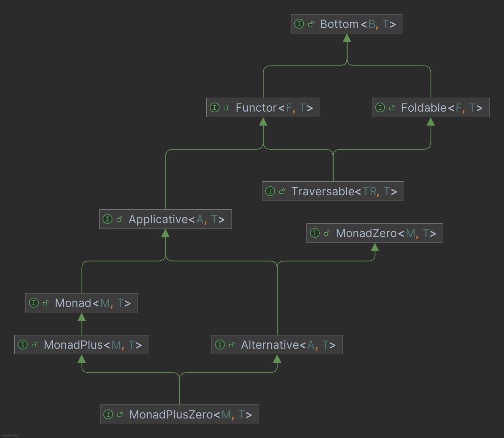

# monad-experiment

A proof of concept library bringing monads to java.
The goal of this library is to provide a generic definition of monads, so code working for all kinds of monads can be
written.

## The Monad interface

The idea is to have a monad interface from which all Monads implement.

```java
public interface Monad<M extends Monad<M, ?>, T> {

    <R> Monad<M, R> bind(Function<T, Monad<M, R>> f);

    default <R> Monad<M, R> map(Function<T, R> f) {
        return this.bind(f.andThen(pure(this.getClass())));
    }

    default <R> Monad<M, R> then(Supplier<Monad<M, R>> f) {
        return bind((T ignore) -> f.get());
    }
}
```

Additionaly all Monady should define a one argument constructor and annotate it with `@MonadConstructor`.
This is the equivalent to the pure function.

```java
public static <M extends Monad<M, T>, T> M pure(T value, Class<M> clazz)
```

can be used to invoke said constructor in generic Code not knowing the concrete implementations of the Monads.

This split into two classes is necessary, because java does not allow static methods to be part of an interface.

### Example: The Maybe Monad

An example implementation of the Monad is the Maybe class.

```java
public class Maybe<T> implements Monad<Maybe<?>, T> {

    private static final Maybe<Void> nothing = new Maybe<>(null);
    private final T value;

    @MonadConstructor
    public Maybe(T value) {
        this.value = value;
    }

    public static <R> Maybe<R> nothing() {
        return (Maybe<R>) nothing;
    }

    public static <T> Maybe<T> unwrap(Monad<Maybe<?>, T> m) {
        return (Maybe<T>) m;
    }

    public T get() {
        return value;
    }

    @Override
    public <R> Maybe<R> bind(Function<T, Monad<Maybe<?>, R>> f) {
        return nothing().equals(this) ? nothing() : f.andThen(Maybe::unwrap).apply(value);
    }
}
```

It is recommended to implement a static `unwarp()` method, like the one seen in Maybe<T>. This helps because `map` and
`bind` return instances of `Monad<M, R>` and not the original type.
The casting done in the `unwrap()` method is safe, a long as no class implements a Monad of another class than itself.

### The Signature of Monad<M extends Monad<M, ?>, T> is horrible! Why?

The Signature of the Monad interface looks like this due to constraints in java generics.
It is currently (2024) not possible to have a generic type with another generic type Parameter.
It might look appealing to define a Monad as `Moand<T>` but this prevents operations like `bind`.

```java
public <R> Monad<R> bind(Function<T, Monad<R>> f);
```

This implementation of bind could return any kind of Monad, as long as it is of type `Monad<R>`. This is
bad, because we only want to use functions that return an Instance of the same Moaned we called bind on
and not any kind of Monad.

## Monads in Java

### Java has Monads already

Java already has many Monads, but you might not have noticed them as such.
The following classes are basically Monads:

* `java.util.Optional` defined by `Optional::of` and `Optional::flatMap`
* `java.util.stream.Steam` defined by `Stream::of` and `Stream::flatMap`
* `java.util.concurrent.CompletableFuture` defined by `CompletableFuture::completedFuture` and
  `CompletableFuture::thenCompose`

 [Project Reactor](https://projectreactor.io/), a popular library, used to build reactive java applications,
 uses two Monads as a main concept to represent "one or none" or "many or none" reactive values.
 
* `reactor.core.publisher.Mono` defined by `Mono::just` and `Mono::flatMap`
* `reactor.core.publisher.Just` defined by `Just::just` and `Just::flatMap`

### Why a monad class? Everything works already!

The benefit of unifying all Monads with a dedicated class, is the ability to write generic code.
Of course this requires more than just the Monad interface. Take Haskell for example, there are multiple classes 
describing the abilities of types.

If these Types are provided, more abstract functionalities can be provided.


