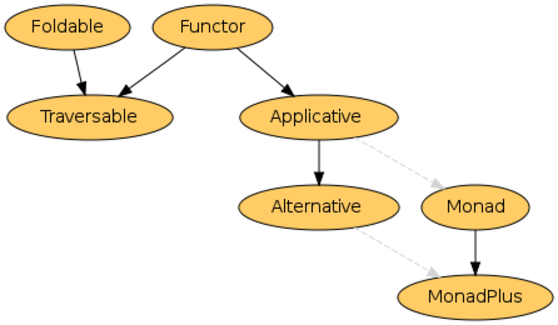
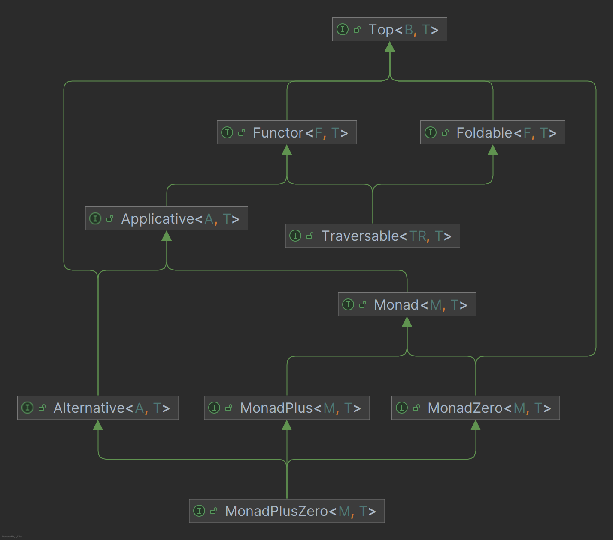

# monad-experiment

A proof of concept library bringing monads to java. The haskell nomenclature for monads is used.
The goal of this library is to provide a generic definition of monads, so code working for all kinds of monads can be
written.

## What is a monad?

Monads are a concept originating from category theory. In functional programming monads are used to combine 
functions/values while wrapping the result in a type with additional computations. Monads are used in places where
the values can't or should not be used directly. This can happen for example if the value might not exist.

A monad `m` is defined by two functions `return` and `bind` .
```haskell 
return :: a -> m a
bind   :: m a -> (a -> m b) -> m b
```
The `return` function can take a value of any kind `a`. This value is then transformed into a value of the monad `m`.
The `bind` function combines a value of type `m a` and a function mapping value of type `a` to a value of type `b` into
a new value of type `m b`.

In the Java typesystem this might look like this (`return` is called `pure` because 'return' is a keyword in java):
```java
interface Monad<A> {
    //...
}
Function<A,Monad<A>> pure;
BiFunction<Monad<A>, Function<A, Monad<B>>, Monad<B>> bind;
```

Note: This code simplifies the signatures as a theoretic class, as `bind` requires the same class `Monad<?>` for each
occurrence in the signature. A function of type 
`<M1 extends Monad, M2 extends Monad> BiFunction<M1<A>, Function<A, M2<B>>, M2<B>>` is therefore not sufficient (and 
this is not valid java code because there are no generic generics...).

## Monads in Java

### Java has Monads already

Java already has many Monads, but you might not have noticed them as such.
The following classes are basically Monads (defined by `return` and `bind`):

* `java.util.Optional` defined by `Optional::of` and `Optional::flatMap`
* `java.util.stream.Steam` defined by `Stream::of` and `Stream::flatMap`
* `java.util.concurrent.CompletableFuture` defined by `CompletableFuture::completedFuture` and
  `CompletableFuture::thenCompose`

[Project Reactor](https://projectreactor.io/), a popular library, used to build reactive java applications,
uses two Monads as a main concept to represent "one or none" or "many or none" reactive values.

* `reactor.core.publisher.Mono` defined by `Mono::just` and `Mono::flatMap`
* `reactor.core.publisher.Just` defined by `Just::just` and `Just::flatMap`

### Why a monad class? Everything works already!

The benefit of unifying all Monads with a dedicated class, is the ability to write generic code.
Of course this requires more than just the Monad interface. Take Haskell for example, there are multiple classes
describing the abilities of types.

If these Types are given, more abstract functionalities can be provided.

Existing libraries often provide useful monads. Sadly most of them don't offer ways to write common code for these 
monads. Utility functions have to be rewritten for each monad, heavily increasing the amount boilerplate code. Many 
small but useful functions can be composed to solve problems. This enforces code reuse and promotes functional paradigm.

This projects type hierarchy is inspired by the haskell hierarchy seen above. Key differences are the splitting of
Haskell's `MonadPlus` into `MonadZero`, `MonadPlus` and `MonadPlusZero` and the introduction of the `Top` type as a
common ancestor to the other types.



The way this project abstracts monads and a list of already implemented monads can be seen later.

### Monad Libraries is Java

A number of functional programming/ monad libraries already exists for java.

#### [Vavr](https://github.com/vavr-io/vavr/tree/master)
One of the more known functional-programming libraries for java is [vavr](https://github.com/vavr-io/vavr/tree/master).
Vavr comes with a lot of functionality which can be considered a small standard-library. It provides not only
immutable data-structures, an altered collections library, property-based testing and more expressive function-interfaces but monadic data-types as well.
Among these types are types similar to existing java types like `Option` (similar to `Optional`) and `Future` (similar to `CompletableFuture`).
`Option` and `Future` repackage existing functionality in a vavr like fashion. Other types like `Try` or `Either` are novel to the java ecosystem.
`Either` is similar to `Option`, but failure now relates to a value, for example the reason why the computation has failed.
`Try` is used to manipulate the control flow in applications. When an `Exception` is thrown, the control-flow differs from the data flow.
`Try` abstracts computations that might throw exceptions, exceptions don't interrupt the data-flow anymore. Control flows like usually.

The `io.vavr.Value` type, which is the top-type of all monadic values in vavr, is more similar to a Functor/Alternative combination. A `Value` must
have a `map` function (Functor) to and can be checked for emptiness (Alternative without the Applicative parts - no pure function).

### [Better Monads](https://github.com/jasongoodwin/better-java-monads/tree/master)

[Better Monads](https://github.com/jasongoodwin/better-java-monads/tree/master) is a small java library trying to improve the
java 8 experience with a `Try` type. The `Try` type offers similar functionality to vavrs-Try. Better monads includes a static
`sequence` Function to transform a `List` of `CompletableFuture`s into a `CompletableFuture` of a `List`
(`List<CompletableFuture<X>>` -> `CompletableFuture<List<X>>`). This library tries to be non-intrusive.

### [purefun](https://github.com/tonivade/purefun/tree/master)

[purefun](https://github.com/tonivade/purefun/tree/master) is a functional java library similar to this one.
It offers Monads (and implementations for many monads) and other types (Monoid, Applicative, Functor, Foldable, etc...) 
and other concepts known from haskell like optics (updating of immutable nested structures) and monad-transformers.

## The Monad interface in this project

As explained above each monad is defined by two functions `bind` and `pure`. It the java context pure is a static 
function. Interfaces can't enforce the implementation of static functions, therefore this handled in another way (this)
is explained later.

The idea is to have a monad interface from which all Monads implement.
The function `map` and `then` can be implemented using `bind` but overriding them with more specialized versions is 
recommended.

```java
public interface Monad<M extends Monad<M, ?>, T> {

    <R> Monad<M, R> bind(Function<T, Monad<M, R>> f);

    default <R> Monad<M, R> map(Function<T, R> f) {
        return this.bind(f.andThen(pure(this.getClass())));
    }

    default <R> Monad<M, R> then(Supplier<Monad<M, R>> f) {
        return bind((T ignore) -> f.get());
    }
}
```

Additionally, all Monads should define a one argument constructor and annotate it with `@MonadConstructor`.
This is the equivalent to the `pure` function.

```java
public static <M extends Monad<M, T>, T> M pure(T value, Class<M> clazz);
```

A function annotated with `@MonadConstructor` can be used to invoke said constructor in generic Code not knowing the 
concrete implementations of the used Monad. This is done by reflection.

This workaround is necessary, because java does not allow static methods to be part of an interface.

If a Monad is defined as a sealed interface (look at the implementation of `Either`) for an example,
`@ApplicativeConstructorDelegate(clazz = ...)` can be used to specify the class which defines the `@MonadConstructor`
which should be used.

### The Signature of Monad<M extends Monad<M, ?>, T> is horrible! Why?

The Signature of the Monad interface looks like this due to constraints in java generics.
It is currently (java 23) not possible to have a generic type with another generic type Parameter.
It might look appealing to define a Monad as `Moand<T>` but this prevents operations like `bind`.

```java
public <R> Monad<R> bind(Function<T, Monad<R>> f);
```

This implementation of bind could return any kind of Monad, as long as it is of type `Monad<R>`. This is
bad, because we only want to use functions that return an Instance of the same Moaned we called bind on
and not any kind of Monad.

### Example: The Maybe Monad

An example implementation of the Monad is this simplified Maybe class.

```java
public class Maybe<T> implements Monad<Maybe<?>, T> {

    private static final Maybe<Void> nothing = new Maybe<>(null);
    private final T value;

    @ApplicativeConstructor
    public Maybe(T value) {
        this.value = value;
    }

    public static <R> Maybe<R> nothing() {
        return (Maybe<R>) nothing;
    }

    public static <T> Maybe<T> unwrap(Top<Maybe<?>, T> m) {
        return (Maybe<T>) m;
    }

    public T get() {
        return value;
    }

    @Override
    public <R> Maybe<R> bind(Function<T, Monad<Maybe<?>, R>> f) {
        return nothing().equals(this) ? nothing() : f.andThen(Maybe::unwrap).apply(value);
    }
}
```

It is recommended to implement a static `unwarp()` method. This helps because generic operations  might return 
instances of `Monad<Maybe<?>, R>` and not the original type. The casting done in the `unwrap()` method is safe, a long 
as no class implements a Monad of another class than itself.

## The Monads implemented

The following monads are already implemented.

## Effect

The `Effect` monad describes computations with side effects. Effects are lazy where possible.
They should never be reused. It is possible for an effect to fail.
This monad is similar to haskell's IO monad. 

## Maybe

The `Maybe` monad can be used to mark the absence of a value. This can mean the value is not necessary (optional) or an 
error occurred and therefore no value exists. 

## Either
The `Either` monad describes a choice of values. `Either` is monadic on its second parameter.
Therefore `map`, `bind` etc... only change the second type argument. The first type usually indicates failure. With this
interpretation `Either` can be used to mimic `Maybe` by using `Either<Void,T>` 


## MList

`MList` is the monadic version of an immutable list. `pure` returns a singleton list and `bind` is basically `flatMap`.

## MParser

`MParser` is a parser combinator. A sequence (`MList`) of some type (like `Character`) is (partly) consumed to generate
a `MList` of possible new values and the remaining tokens. An empty `MList` indicates failure.

Multiple `MParser`s can be combined to new parsers. Multiple parsers parsing the `Character`s of '0'...'9' could be
combined to parse a `String`. This parser can be transformed to an `Integer` parser by supplying `Integer::parseInt` to
the `map` function of the parser.